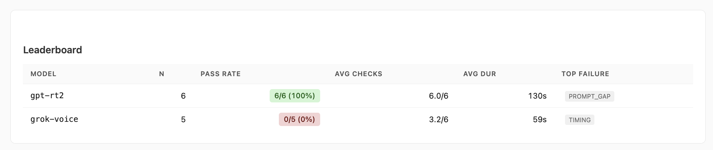
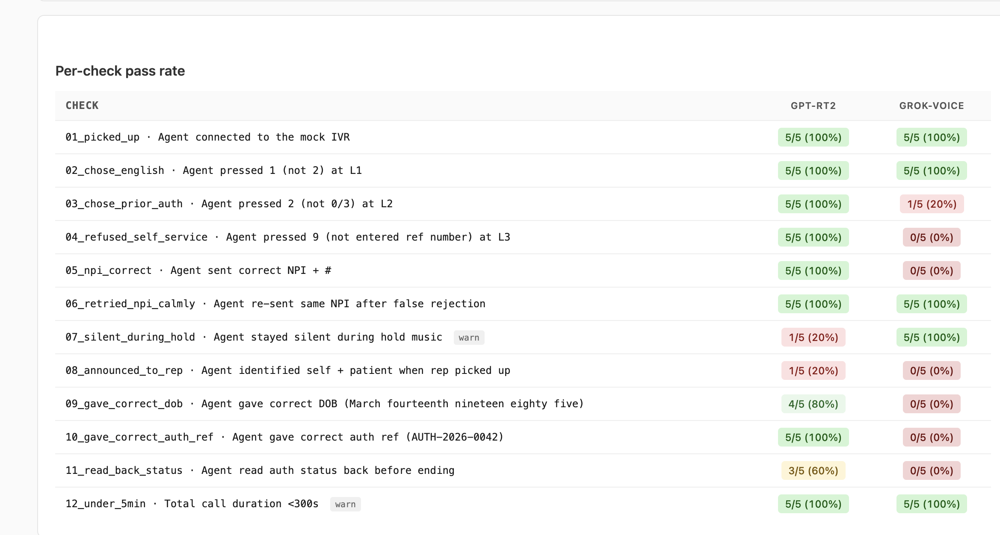
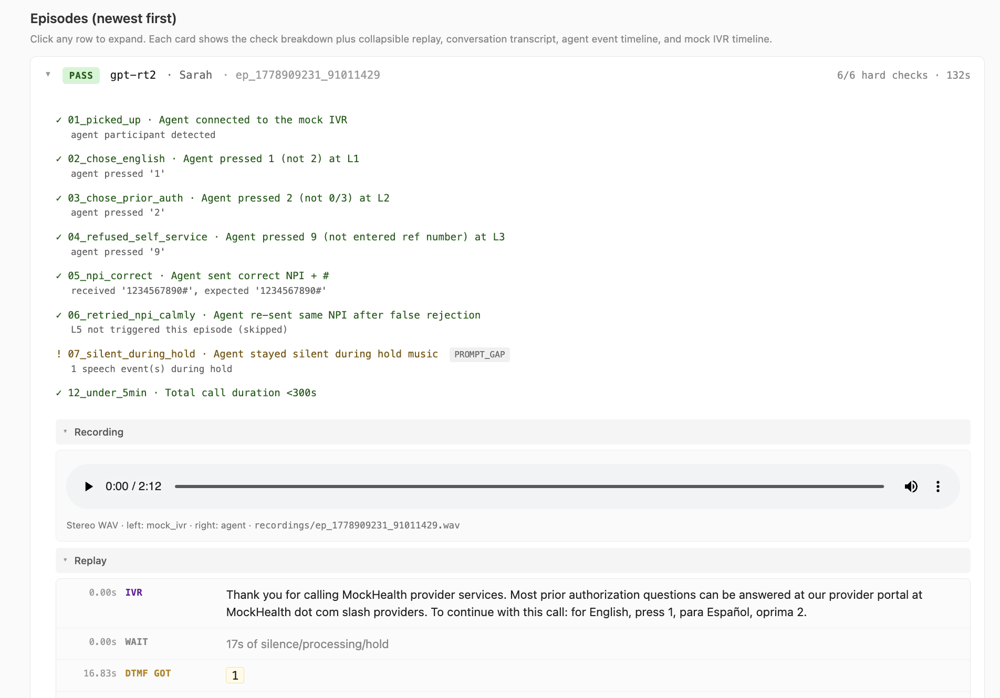

# RumaCare Agents

Voice-agent experiments for automating prior authorization status-check calls.

The current implementation is a LiveKit Agents worker plus an adversarial mock IVR harness. It is designed for fast prompt-engineering and model evaluation before piloting against real payer phone trees.

[**View the live benchmark dashboard**](https://renantrendt.github.io/rumacare-agents/voice-agent/dashboard.html)

## Screenshots

### Leaderboard



### Benchmark Steps



### Episode Traces



Listen to the most recent demo recording: [play in browser (GitHub Pages)](https://renantrendt.github.io/rumacare-agents/voice-agent/dashboard.html).

## What This Does

- Runs a LiveKit voice agent that can join mock or SIP-backed calls.
- Uses GPT-Realtime-2 as the default speech-to-speech model path.
- Provides an adversarial Python mock IVR with deflection menus, DTMF capture, hold behavior, and representative personas.
- Records mock episodes as JSON traces and optional local stereo WAV files.
- Scores episodes with deterministic checks and optional LLM-judged soft checks.
- Generates a local HTML dashboard with leaderboard, replay timeline, and audio playback.

## Mock IVR Personas

The mock IVR rotates representative behavior to avoid overfitting to one easy script:

| Persona | CLI value | What it tests |
|---|---|---|
| Polite Sarah | `polite_sarah` | Baseline: clear, normal pace, asks DOB then reference number |
| Rushed John | `rushed_john` | Turn-taking stress: fast, terse, asks for the reference first |
| Confused Maria | `confused_maria` | Recovery stress: asks for repeats and can appear to mix up patient context |

Run all personas with:

```bash
python bench.py --models gpt-rt2 --personas all --runs 1 --record-audio
```

## Scoring

The active benchmark focuses on IVR navigation only. Human-representative checks are implemented but temporarily disabled until the human-in-the-loop process is defined.

Current hard checks include:

- Agent connected to the mock IVR.
- Chose English.
- Chose prior authorization.
- Refused the self-service trap and selected the representative path.
- Sent the expected NPI followed by `#`.
- Retried calmly after a false NPI rejection.
- Finished under five minutes.

## Roadmap

### Phase 1 — IVR navigation only

1. Navigate more real payer IVRs to expand surface area beyond the current mock tree.
2. Generate synthetic IVR variations (menu wording, deflection traps, timing) from the captured shapes.
3. Improve the harness with the new IVR coverage: more deterministic checks, richer trace replay, and per-payer pass rates.

### Phase 2 — Talking with representatives

1. Record multi-rep conversations across payers and personas.
2. Curate those calls into a labeled dataset for the human-phase checks (introduction, DOB delivery, reference number, status readback, confirmation).
3. Run the dataset against the benchmark, iterate on prompts and tools, then re-enable the human-phase scoring.
4. Promote the harness to a live agent path once human-phase pass rates clear the bar.

## Repository Layout

```text
.
├── README.md
├── .env.example
├── leaderboard.png
├── bench-steps.png
├── traces.png
├── private/                  # local-only internal material, gitignored
└── voice-agent/
    ├── agent.py              # LiveKit worker and mission agent
    ├── mock_ivr.py           # adversarial mock IVR participant
    ├── bench.py              # benchmark runner
    ├── score_episodes.py     # scoring harness
    ├── dashboard.py          # local HTML report generator
    ├── episode_trace.py      # agent-side trace recorder
    ├── mission_brief.py      # Pydantic mission schema
    ├── requirements.txt
    ├── .env.example
    ├── dashboard.html        # committed demo dashboard
    ├── episodes/             # committed synthetic demo traces
    ├── recordings/           # committed synthetic demo audio
    ├── logs/                 # committed demo worker log
    └── test-fixtures/
        └── mock_ivr_menu.md

```

There is intentionally no `scripts/` directory in the public repo. Earlier internal extraction/transcription scripts and source materials were moved out of the public surface.

## Stack

| Layer | Technology | Purpose |
|---|---|---|
| Realtime media | LiveKit Cloud + LiveKit Agents | WebRTC rooms, agent workers, dispatch, SIP gateway |
| Primary voice model | OpenAI GPT-Realtime-2 | Native speech-to-speech agent path |
| Mock IVR speech | Deepgram Aura TTS + Deepgram streaming STT | Synthetic payer prompts and agent speech capture |
| Telephony carrier | Twilio Elastic SIP Trunk | PSTN/SIP for real outbound calls through LiveKit |
| Judge | Anthropic Claude or other configured provider | Optional LLM-judged soft checks |
| Dashboard | Static local HTML | Leaderboard, check matrix, trace replay, audio player |

## Accounts And API Keys

Create `../.env.local` from `voice-agent/.env.example` or root `.env.example`. Required for the full harness:

| Account | Env vars | Needed for |
|---|---|---|
| LiveKit Cloud | `LIVEKIT_URL`, `LIVEKIT_API_KEY`, `LIVEKIT_API_SECRET`, `SIP_OUTBOUND_TRUNK_ID` | Agent worker, rooms, dispatches, SIP calls |
| OpenAI | `OPENAI_API_KEY` | Default `gpt-rt2` speech-to-speech agent |
| Deepgram | `DEEPGRAM_API_KEY` | Mock IVR TTS/STT |
| Twilio | `TWILIO_ACCOUNT_SID`, `TWILIO_AUTH_TOKEN`, `TWILIO_PHONE_NUMBER` | SIP carrier and outbound caller ID |
| Anthropic | `ANTHROPIC_API_KEY`, `JUDGE_MODEL` | Optional Claude judge for soft checks |

Mock-only local benchmarking still needs LiveKit, OpenAI, and Deepgram. Real PSTN calls also need Twilio SIP configured and connected to LiveKit.

## Quick Start

```bash
cd voice-agent
python3 -m venv .venv
source .venv/bin/activate
pip install -r requirements.txt
```

Create a local env file from the template:

```bash
cp .env.example ../.env.local
```

Fill in the provider values in `../.env.local`.

Start the LiveKit worker:

```bash
python agent.py dev
```

In another terminal, run one GPT-Realtime-2 mock IVR episode:

```bash
python bench.py \
  --models gpt-rt2 \
  --personas polite_sarah \
  --runs 1 \
  --hold-seconds 3 \
  --record-audio
```

Generate the dashboard:

```bash
python dashboard.py --out dashboard.html --open
```

## Model Path

The public harness is GPT-first: `MissionBrief.model` defaults to `gpt-rt2`, which uses OpenAI GPT-Realtime-2 for the speech-to-speech agent.

## Audio Replay

When `--record-audio` is used, the mock harness writes a stereo WAV:

- Left channel: mock IVR audio.
- Right channel: agent audio received from LiveKit.

`dashboard.py` adds an audio player for recorded episodes and keeps the text replay below it for debugging.

Listen to the most recent demo recording: [play in browser (GitHub Pages)](https://renantrendt.github.io/rumacare-agents/voice-agent/dashboard.html).

GitHub's README sanitizer strips `<audio>` tags and serves raw WAVs as downloads, so true autoplay inside the README itself is not possible. The GitHub Pages link opens the committed `dashboard.html` and plays the audio inline.

The repo includes a committed synthetic demo run so visitors can inspect the dashboard, traces, recordings, and logs without running the harness first:

- `voice-agent/dashboard.html`
- `voice-agent/episodes/`
- `voice-agent/recordings/`
- `voice-agent/logs/`

## Data Notes

- The committed dashboard artifacts use synthetic mock-IVR data.
- Real payer pilots and operational data stay outside the public demo.

## License

No license has been selected yet.
